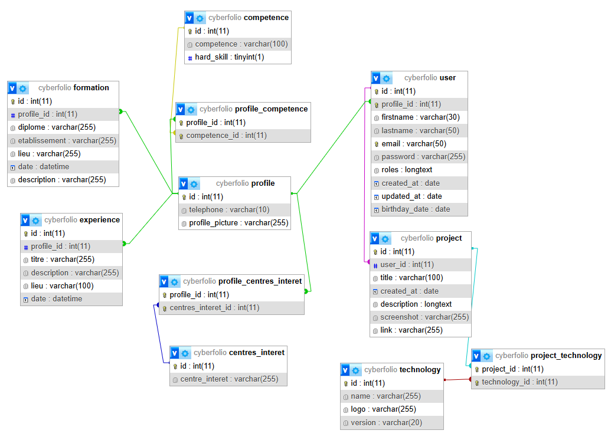

# Projet « Cyberfolio »

## Contexte
Ce projet de cyberfolio a été créé dans le contexte d'un cours de php symfony. Les attendus minimum sont mettre en place une gestion complète de l'authentification et des autorisations à l'aide du SecurityBundle de Symfony, assurant ainsi un contrôle précis des accès utilisateurs. Du côté back-office, un CRUD intégral sera implémenté pour l'entité Project, incluant la validation des données et la gestion de l'upload des captures d'écran associées aux projets. Sur le front-office, une interface sera développée pour afficher la liste des projets disponibles. Enfin, les ressources statiques, tant pour le back-office que pour le front-office, seront gérées efficacement grâce au composant AssetMapper, garantissant une organisation et une optimisation des assets.

Ce projet est une sorte de plateforme de cyberfolio. Chaque utilisateur peut, en se créant un compte, avoir un profil style CV (avec expériences, formations, compétences, ...), ajouter des projets qu'ils souhaitent partager et visionner les différents profils et projets.

### User stories
Trois roles sont disponibles, hors utilisateur non connecté: `ROLE_USER`, `ROLE_ADMIN`, `ROLE_SUPER_ADMIN`.

- En tant qu'utilisateur non connecté, je peux:
- - Afficher la liste des projets `http://127.0.0.1:8000/`
- - Afficher la liste des profils `http://127.0.0.1:8000/profile`
- - Afficher un profil en particulier: `http://127.0.0.1:8000/profile/{id}`
- - Afficher les projets d'un profil : `http://127.0.0.1:8000/project/user/{id}`
- - Afficher un projet en particulier: `http://127.0.0.1:8000/project/5`
- - Me créer un compte si besoin: `http://127.0.0.1:8000/register`
- - Me connecter : `http://127.0.0.1:8000/login`
- - Me déconencter


- En tant qu'utilisateur connecté (ROLE_USER), je peux:
- - Afficher la liste des projets `http://127.0.0.1:8000/`
- - Afficher la liste des profils `http://127.0.0.1:8000/profile`
- - Afficher un profil en particulier: `http://127.0.0.1:8000/profile/{id}`
- - Afficher les projets d'un profil : `http://127.0.0.1:8000/project/user/{userId}`
- - Afficher un projet en particulier: `http://127.0.0.1:8000/project/{id}`
- - Créer un nouveau projet: `http://127.0.0.1:8000/project/new`
- - Editer ses propres projets: `http://127.0.0.1:8000/project/{id}/edit`
- - Supprimer ses propres projets
- - Aller sur son propre profil: `http://127.0.0.1:8000/profile/myProfile`
- - Modifier son profil: `http://127.0.0.1:8000/profile/20/edit`
- - Supprimer son propre profil
- - Me déconnecter


- En tant qu'administrateur (ROLE_ADMIN), je peux:
- - Afficher la liste des projets `http://127.0.0.1:8000/`
- - Afficher la liste des profils `http://127.0.0.1:8000/profile`
- - Afficher un profil en particulier: `http://127.0.0.1:8000/profile/{id}`
- - Afficher les projets d'un profil : `http://127.0.0.1:8000/project/user/{userId}`
- - Afficher un projet en particulier: `http://127.0.0.1:8000/project/{id}`
- - Créer un nouveau projet: `http://127.0.0.1:8000/project/new`
- - Editer ses propres projets et ceux des autres: `http://127.0.0.1:8000/project/{id}/edit`
- - Supprimer ses propres projets et ceux des autres
- - Aller sur son propre profil: `http://127.0.0.1:8000/profile/myProfile`
- - Modifier son profil et ceux des autres: `http://127.0.0.1:8000/profile/20/edit`
- - Supprimer son propre profil
- - Afficher les utilisateurs `http://127.0.0.1:8000/user`
- - Afficher un utilisateur en particulier `http://127.0.0.1:8000/user/{id}`
- - Supprimer un utilisateur mais pas le sien
- - Créer un utilisateur `http://127.0.0.1:8000/user/new`
- - Me déconnecter


- En tant que super administrateur (ROLE_SUPER_ADMIN), je peux:
- - Afficher la liste des projets `http://127.0.0.1:8000/`
- - Afficher la liste des profils `http://127.0.0.1:8000/profile`
- - Afficher un profil en particulier: `http://127.0.0.1:8000/profile/{id}`
- - Afficher les projets d'un profil : `http://127.0.0.1:8000/project/user/{userId}`
- - Afficher un projet en particulier: `http://127.0.0.1:8000/project/{id}`
- - Créer un nouveau projet: `http://127.0.0.1:8000/project/new`
- - Editer ses propres projets et ceux des autres: `http://127.0.0.1:8000/project/{id}/edit`
- - Supprimer ses propres projets et ceux des autres
- - Aller sur son propre profil: `http://127.0.0.1:8000/profile/myProfile`
- - Modifier son profil et ceux des autres: `http://127.0.0.1:8000/profile/20/edit`
- - Supprimer son propre profil
- - Afficher les utilisateurs `http://127.0.0.1:8000/user`
- - Afficher un utilisateur en particulier `http://127.0.0.1:8000/user/{id}`
- - Supprimer un utilisateur mais pas le sien
- - Créer un utilisateur `http://127.0.0.1:8000/user/new`
- - Attribuer et enlever des droits / roles aux autres users `http://127.0.0.1:8000/admin/{userId}`
- - Me déconnecter

## Compte administrateur

- URL du *back-office* : 
- `http://127.0.0.1:8000/user` Voici une route que seuls les utilisateurs ayant au moins un role admin peuvent accéder.
- `http://127.0.0.1:8000/admin/{userId}` Voici une route uniquement accessible par les super admins.


- Identifiant Admin : `admin@mail.com`
- Mot de passe Admin : `Password.123`


- Identifiant Super-Admin : `superadmin@mail.com`
- Mot de passe Super-Admin : `Password.123`

- Pour le compte normal, libre à vous de vous créer un compte : `http://127.0.0.1:8000/register`

## État d'avancement

Je pense avoir bien avancé. J'ai pu implémenter les autres tables dans la base de données (compétences, expériences, formation, centres d'intérets).
J'ai pu faire le minimum requis et un peu plus. De manière globale, je me suis axée sur les fonctionnalités et non sur le front où l'expérience utilisateur.
J'ai également créé des fixtures.

Cependant, il y a encore des choses que je n'ai pas eu le temps de "paufiner":
- Le style: le css apporté sur cette application n' pas vraiment de sens (couleurs, formes, ...), de plus, le style n'est pas responsive
- Les erreurs: Dans certains formulaires les erreurs sont bien affichées lorsqu'il y en a mais dans d'autres elles ne sont pas affichées
- La gestion des codes web: J'aurais aimé pouvoir afficher un template lorque l'on tombe sur une 404
- La structure du projet: Le ménage n'a pas été fait dans le code, il se peut très bien que des choses inutiles soient restées
- La sécurité: L'application a bel et bien un système de roles et d'authentification mais je ne sais pas si c'est suffisant pour sécuriser l'application (notamment pour le titre cda)
- Le super admin: il est le seul à pouvoir donner des droits mais lorsqu'un utilisateur est crée il est automatiqument ROLE_USER, la question se pose: Comment on obtient un Super Admin ? Après réflexion, cela peut surement être géré dans les fixtures.

## Difficultés rencontrées et solutions

J'ai fait en sorte de terminer tous les tp avant de commencer ce projet cyberfolio, afin de commencer sur une bonne base de connaissances.
J'ai commencé à avoir des difficultés notamment au niveau des formulaires. Par exemple, avec la fonctionnalité d'ajout et suppression de compétences, centres d'intérets, expériences et formations
dans un seul et même formulaire. J'ai essayé d'utiliser Turbo UX mais je n'ai pas réussi. J'avais beaucoup de mal à imbriquer les différents formulaires dans le formulaire global, 
sans que l'un n'empêche l'autre de fonctionner correctement. Ma deuxième difficulté plus mineure se portait sur les relations entre les tables, j'ai eu du mal avec mappedBy et inversedBy. Ceci m'a également
causé des difficultés sur la création de mes fixtures car mes relations n'étaient pas bonnes.

## Bilan des acquis

- php
- symfony
- sécurité
- hiérarchie des roles
- templating

## Remarques complémentaires

### Base de données


### Installation du projet

#### 1- Récupération du projet
Dans un terminal:

``git clone https://github.com/SyraxTarg/Cyberfolio.git <nom du dossier>``

#### 2- Installation des dépendances
Dans un terminal, à la racine du projet:

``composer install``


#### 3- Configuration de l'environnement
- Copiez le fichier `.env` et appelez-le `.env.local`.
- Configurer dans le fichier .env.local les paramètres de connexion à la base de données en prenant 
soin de vérifier au préalable le type de serveur de votre environnement (MySQL ou MariaDB).
- Le fichier est pré-configuré, vous devez juste renseigner vos identifiants de base de données ainsi que APP_SECRET


#### 4- Mise en place de la base de données
Importez la base de données `cyberfolio.sql` du dossier `/data`.

OU

Utilisez les fixtures (ATTENTION: en utilisant cette méthode vous n'aurez pas d'admin ou de super admin)

Dans un terminal:

```
php bin/console doctrine:database:drop --force --if-exists
php bin/console doctrine:database:create
php bin/console doctrine:schema:create 
php bin/console doctrine:fixtures:load
```

#### 5- Démarrer l'application
```
symfony server:start
```
Vous pouvez aller directement à la racine.
```
http://127.0.0.1:8000/
```
